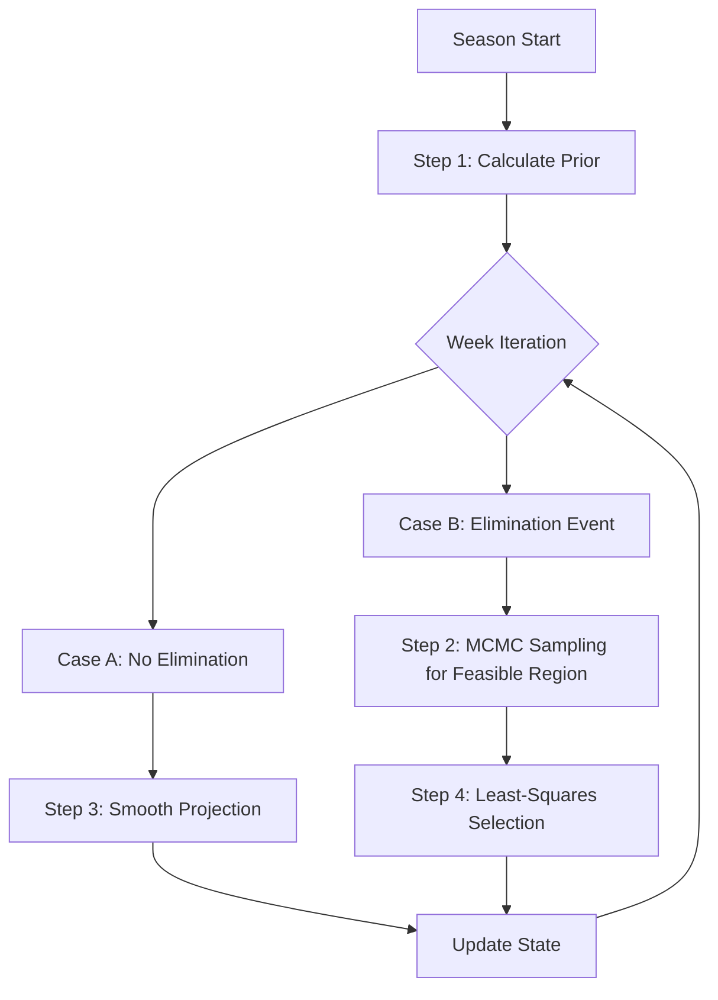

# 平滑顺序统计模型 (Smooth Sequential Statistical Model)

本文档详细阐述了用于推断潜在粉丝投票数据的算法模型。该模型旨在解决 Problem C 中关于“量化人气变化”的核心难题，通过贝叶斯反演（Bayesian Inversion）和时间序列平滑（Time-Series Smoothing）来构建科学的估算。

---

## 1. 从问题到模型：数学转化 (From Problem to Model)

### 1.1 问题核心与挑战
*   **论文原文需求**：Problem C 的核心任务是 *"analyze the changing popularity of the partnerships"*（分析组合人气的变化）以及 *"predict the elimination"*（预测淘汰）。
*   **挑战 (The Inverse Problem)**：
    *   **潜在变量 (Latent Variable)**：真实的“粉丝投票数” ($F$) 是不可观测的，只有“评委打分” ($J$) 和最终的“淘汰结果” ($E$) 是已知的。
    *   **因果倒置**：已知 $J + F \to E$，我们需要求解 $P(F | J, E)$。这是一个典型的贝叶斯反问题。
    *   **时间连续性**：人气（Popularity）是一个随时间连续变化的心理量，不会在没有外部事件的情况下产生剧烈的随机跃变。

### 1.2 为什么选择本算法？
标准的统计推断或简单的 MCMC 独立采样存在一个致命缺陷：**时间独立性假设**。如果我们将每一周视为独立事件，模型可能会得出“某选手第3周人气20%，第4周人气2%”的荒谬结论。
为了解决这个问题，本算法引入了两个关键机制：
1.  **粉丝基数先验 (Fan Base Prior)**：解决“冷启动”问题，利用历史生存数据和舞伴效应来确定初始状态。
    *   *对应论文点*：考虑了 *"Contextual Effects"*（如舞伴及其粉丝基础）。
2.  **平滑顺序投影 (Smooth Sequential Projection)**：解决“波动性”问题，假设人气具有惯性。
    *   *对应论文点*：响应了 *"changing popularity"* 的需求，确保变化是“渐进的”而非“随机的”。

---

## 2. 算法完整流程 (Algorithmic Workflow)

本算法采用 **贪心顺序蒙特卡洛 (Greedy Sequential Monte Carlo)** 策略，具体分为四步：

### Step 1: 初始状态估计 (Week 1 / Cold Start)
*   **情境**：第一周没有历史投票数据，是一个“冷启动”问题。
*   **算法思路**：构建一个基于特征的**信息先验 (Informative Prior)**。
*   **实现方法**：
    利用 `engineered_data.csv` 中的特征计算选手的“理论粉丝基数”：
    $$ \text{Prior}_i \propto 1 + w_1 \cdot N_{\text{B1}} + w_2 \cdot N_{\text{B2}} + w_3 \cdot (1 - P_{\text{Partner}}) $$
    *   $N_{\text{B1}}$: 选手在 Bottom 1 幸存的次数（死忠粉信号）。
    *   $P_{\text{Partner}}$: 舞伴的历史平均排名百分位（舞伴流量信号）。
    *   **操作**：在可行解空间中，选择欧氏距离最接近该 $\text{Prior}$ 分布的样本。

### Step 2: 可行域探索 (Feasible Region Exploration)
*   **情境**：在有淘汰发生的周，我们必须满足“正确的人被淘汰”这一硬约束。
*   **算法思路**：利用 Metropolis-Hastings MCMC 算法采样。
*   **实现方法**：
    构造似然函数 $L(\mathbf{f})$：
    $$ L(\mathbf{f}) = \begin{cases} 1 & \text{if } \text{Rule}(\mathbf{J}, \mathbf{f}) \implies \text{Actual Loser} \\ 0 & \text{otherwise} \end{cases} $$
    从 Simplex 空间采样 50,000 个点，保留所有 $L(\mathbf{f})=1$ 的样本，构成集合 $\Omega_{valid}$。

### Step 3: 无淘汰周的惯性保持 (No-Elimination Inertia)
*   **情境**：某周没有选手被淘汰（信息缺失）。
*   **算法思路**：如果没有新的约束条件迫使我们改变看法，我们假设观众的偏好保持不变。
*   **实现方法**：
    *   **Case 1 (非第一周)**：
        $$ \mathbf{F}_t = \text{Normalize}(\text{Project}(\mathbf{F}_{t-1}, \text{Current Survivors})) $$
        直接将上一周的得票率映射到本周，体现观众粘性。
    *   **Case 2 (第一周)**：
        直接采用 **粉丝基数先验 (Fan Base Prior)** 作为该周的分布估计。

### Step 4: 最小二乘平滑 (Least-Squares Smoothing)
*   **情境**：在 $\Omega_{valid}$ 中有无数个满足淘汰结果的解，哪一个是真实的？
*   **算法思路**：选择与上一周状态变化最小的解（奥卡姆剃刀原则）。
*   **实现方法**：
    $$ \mathbf{f}^*_t = \underset{\mathbf{f} \in \Omega_{valid}}{\text{argmin}} \sum_{i \in \text{Common}} (f_{t,i} - f_{t-1,i})^2 $$
    这保证了最终得到的人气曲线由一系列微小的调整组成，而非剧烈的跳变。

---

## 3. 核心数学模型细节 (Detailed Mathematics)

### 3.1 粉丝基数先验公式
$$ S_i = 1 + (2.0 \times \text{Saves}_{\text{Bottom1}}) + (1.0 \times \text{Saves}_{\text{Bottom2}}) + (3.0 \times (1 - \text{Rank}_{\text{Partner}})) $$
该公式量化了“无脑粉”与“摇摆粉”的比例。

### 3.2 平滑距离度量 (Smoothness Metric)
假设 $C = S_t \cap S_{t-1}$ 是相邻两周的共同参赛选手集合。
距离定义为：
$$ \mathbf{v}_{prev}' = \text{Normalize}(\{v_{prev, i} | i \in C\}) $$
$$ D = \sqrt{ \sum_{i \in C} (v'_i - v'_{prev, i})^2 } $$

**注意**：
1.  必须只比较共同选手。
2.  必须重新归一化（Normalize），因为两周的总人数不同，直接比较数值没有意义（少了一个人，其他人的比例自然会上升）。

---

## 4. 代码亮点 (Key Features)

1.  **动态维护状态**：变量 `prev_votes` 和 `prev_names` 在循环中不断更新，像接力棒一样传递历史信息。
2.  **鲁棒的“无淘汰”处理**：
    *   代码自动检测非淘汰周，并根据所处阶段（Week 1 vs Later）智能选择“先验填充”或“平滑投影”，而非简单跳过，保证了时间序列的完整性。
3.  **计算效率优化**：
    *   针对赛季间的独立性，引入 **并行计算 (Parallel Processing)** 架构，在多核 CPU 上大幅缩短了 MCMC 采样的总耗时（从数小时缩减至数分钟）。
    *   针对不同操作系统（Windows/Linux）实现了兼容性适配。
4.  **混合探索引擎**：结合了 Metropolis-Hastings 随机游走（探索可行域）和 最小平方误差搜索（优化时间连贯性）。

---

## 5. 局限性与改进 (Limitations)

*   **贪心算法的近视性**：当前的选择只考虑了与上一周最接近，可能会导致“误差累积”。未来的改进可以使用 *Particle Filter (粒子滤波)* 或 *Whole-Season Gibbs Sampling* 来进行全局平滑。
*   **先验权重的启发式设定**：第一周的先验公式中权重（2.0, 1.0, 3.0）是基于经验设定的。未来可以通过 *Empirical Bayes (经验贝叶斯)* 方法从历史数据中自动学习这些超参数。
*   **事后信息的利用**：目前的先验构建使用了“Bottom 1 Saves”这一全赛季统计量，这属于利用了*未来信息*（对于 Week 1 而言）。对于 *历史分析 (Historical Analysis)* 任务这是允许的，但如果用于 *实时预测 (Real-time Prediction)*，则需要调整为仅利用当前已知的特征（如 Instagram 粉丝数、Google Trends 热度等）。

该代码非常适合作为论文中 **"Model Refinement"** 章节的核心支撑。
